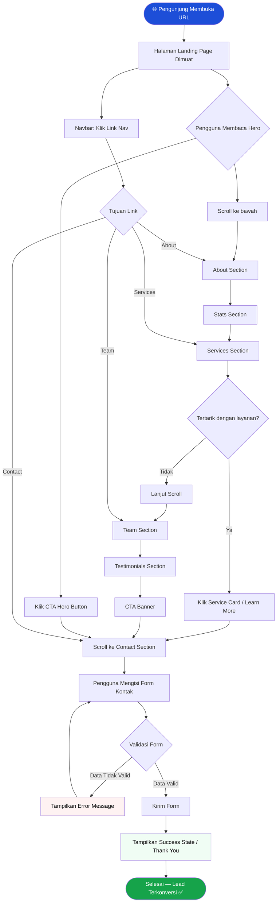

# 📋 PRD — Company Profile Landing Page Template

## Ringkasan Produk

**Nama Produk:** ExaCommerce — Company Profile (Compro) Template  
**Versi:** 1.0  
**Dibuat:** 23 Juni 2026  
**Status:** Draft

---

## 1. Latar Belakang & Tujuan

Template landing page company profile dirancang sebagai fondasi generik yang dapat digunakan oleh berbagai jenis bisnis (layanan, manufaktur, konsultasi, agensi) untuk merepresentasikan identitas dan proposisi nilai mereka secara digital.

**Tujuan utama:**
- Memperkenalkan brand/perusahaan kepada pengunjung baru
- Membangun kepercayaan melalui tampilan profesional dan konten kredibilitas
- Mengonversi pengunjung menjadi *lead* melalui form kontak atau CTA

---

## 2. Target Pengguna

| Peran | Deskripsi |
|---|---|
| **End User / Pengunjung** | Calon klien, mitra bisnis, investor yang mengunjungi website perusahaan |
| **Template Developer** | Developer yang menggunakan template ini sebagai basis proyek klien |
| **Pemilik Bisnis** | Owner yang mengisi konten dan menyesuaikan branding |

---

## 3. Scope & Fitur

### 3.1 Fitur Wajib (Must Have)

- [x] **Hero Section** — Tagline utama, subheading, dan CTA button
- [x] **About Section** — Misi, visi, dan cerita singkat perusahaan
- [x] **Services / Products Section** — Daftar layanan atau produk unggulan
- [x] **Stats / Social Proof** — Angka pencapaian (klien, tahun berdiri, proyek)
- [x] **Team Section** — Profil tim inti
- [x] **Testimonials** — Kutipan dari klien atau mitra
- [x] **Contact Section** — Form kontak + informasi alamat/email/telepon
- [x] **Navbar** — Navigasi responsif dengan mobile hamburger menu
- [x] **Footer** — Link penting, copyright, sosial media

### 3.2 Fitur Opsional (Nice to Have)

- [ ] **Portfolio / Case Study Section** — Proyek atau hasil kerja
- [ ] **Blog / Artikel** — Wawasan industri
- [ ] **FAQ Section** — Pertanyaan umum
- [ ] **Partner/Client Logo Strip** — Logo mitra atau klien besar

---

## 4. Struktur Halaman (Page Architecture)

```
Landing Page (Single Page / Multi-section)
│
├── Navbar (Sticky)
│   ├── Logo
│   ├── Nav Links (About, Services, Team, Contact)
│   └── CTA Button (Get in Touch)
│
├── Hero Section
│   ├── Headline Utama
│   ├── Sub-headline
│   ├── CTA Primary Button
│   └── Hero Image / Illustration
│
├── About Section
│   ├── Company Overview Text
│   ├── Misi & Visi Cards
│   └── Sejarah / Timeline (Opsional)
│
├── Stats Section
│   ├── Angka Klien
│   ├── Tahun Berdiri
│   ├── Proyek Selesai
│   └── Kepuasan Klien
│
├── Services Section
│   ├── Service Card 1
│   ├── Service Card 2
│   └── Service Card 3..N
│
├── Portfolio Section (Opsional)
│   ├── Filter Kategori
│   └── Grid Portofolio
│
├── Team Section
│   ├── Team Member Card 1
│   └── Team Member Card 2..N
│
├── Testimonials Section
│   ├── Testimonial Card (Carousel/Grid)
│   └── Rating / Stars
│
├── CTA Banner
│   ├── Ajakan Utama
│   └── Button Kontak
│
├── Contact Section
│   ├── Form (Nama, Email, Pesan)
│   ├── Map Embed (Opsional)
│   └── Kontak Info (Telepon, Email, Alamat)
│
└── Footer
    ├── Logo & Tagline
    ├── Navigasi Cepat
    ├── Sosial Media
    └── Copyright
```

---

## 5. Spesifikasi Komponen Utama

### 5.1 Navbar
| Properti | Spesifikasi |
|---|---|
| Posisi | `sticky top-0` |
| Breakpoint Mobile | `≤ 768px` — Hamburger menu |
| Animasi | Slide-in drawer dari kiri |
| Konten | Logo, nav links, CTA button |

### 5.2 Hero Section
| Properti | Spesifikasi |
|---|---|
| Layout | Split: Teks kiri, Gambar kanan |
| Headline | `clamp(36px, 5vw, 64px)` |
| CTA Button | Primary (solid) + Secondary (outline) |
| Background | Dark gradient atau full-bleed image |

### 5.3 Services Section
| Properti | Spesifikasi |
|---|---|
| Layout | Grid `auto-fit minmax(280px, 1fr)` |
| Kartu | Ikon + Judul + Deskripsi singkat |
| Hover | Elevasi shadow + border highlight |

### 5.4 Contact Form
| Field | Tipe | Wajib |
|---|---|---|
| Nama Lengkap | `text` | ✅ |
| Email | `email` | ✅ |
| Nomor Telepon | `tel` | ❌ |
| Subjek | `text` | ❌ |
| Pesan | `textarea` | ✅ |

---

## 6. Persyaratan Non-Fungsional

| Aspek | Target |
|---|---|
| **Responsivitas** | Mobile (`320px`), Tablet (`768px`), Desktop (`1280px`) |
| **Performance** | Lighthouse Score ≥ 85 |
| **Aksesibilitas** | Kontras warna WCAG AA, alt text pada semua gambar |
| **SEO** | Title, Meta Description, H1 unik per halaman |
| **Font** | Google Fonts (Inter / Plus Jakarta Sans) |
| **Animasi** | Scroll reveal pada section masuk viewport |

---

## 7. Flowchart — Alur Navigasi Pengguna



---

## 8. Kriteria Penerimaan (Acceptance Criteria)

- [ ] Navbar tampil responsif dengan hamburger menu di mobile
- [ ] Hero section memuat di bawah 1.5 detik (LCP)
- [ ] Semua form field tervalidasi sebelum submit
- [ ] Halaman tidak mengalami horizontal scroll di mobile
- [ ] Setiap section memiliki animasi scroll-reveal halus
- [ ] Konten dapat diganti tanpa mengubah struktur komponen (data-driven)

> **Catatan:** Panduan UI/UX, warna, tipografi, dan referensi visual akan didokumentasikan secara terpisah dalam Design Document.
